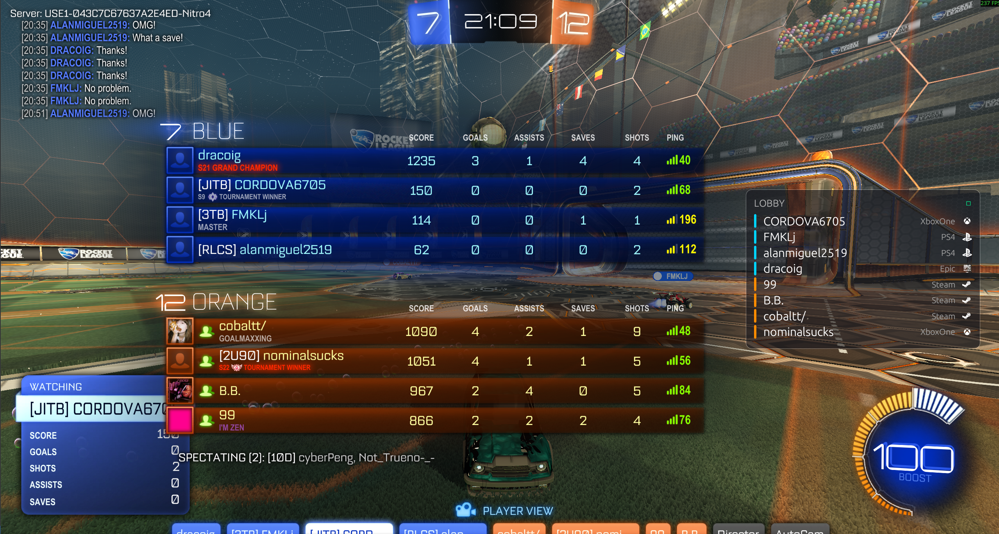

# RL-Platform-Overlay



A lightweight, high-performance Rocket League overlay for tracking player platforms, real-time MMR/ranks, session stats, and teammate boost in real time.

> [!IMPORTANT]
> **100% Anti-Cheat Safe**: This overlay runs as a completely separate, out-of-process application. It **does not** inject DLLs, modify game memory, or hook graphics APIs, making it fully compliant with Easy Anti-Cheat (EAC) and safe from bans.

---

## ⚡ Quick Start Guide

You can get the overlay running in less than 2 minutes:

1. **Download the app**: Download the latest pre-built executable from [Releases](https://github.com/Lucashamburguru/RL-Platform-Overlay/releases).
2. **Auto-Configure Rocket League**:
   - Open the application.
   - Go to the **Setup** tab, click **Auto-detect** to find your Rocket League folder, and click **Enable Stats API**.
   - Restart Rocket League if it was already running.
3. **Launch the Overlay**: Customize your hotkeys on the settings page, click **Launch Overlay**, and play!

*Note: If you prefer manual configuration, you can edit your game's `TAGame/Config/DefaultStatsAPI.ini` file and set `PacketSendRate` to a value greater than `0` (e.g. `30.0`).*

---

## 🎮 Features

* **See Ranks & MMR Instantly**: View the Matchmaking Rating (MMR) and rank brackets for everyone in your lobby (Steam, Epic, PlayStation, Xbox, Switch) directly on your screen—no Alt-Tabbing required.
* **Ballchasing.com Replay Auto-Uploader**: Automatically uploads your replays to Ballchasing.com immediately after each match ends. Supports bulk uploading of historical files with progress, pause/stop controls, Ballchasing-friendly 30-second pacing, cloud syncing, cache clearing, and custom visibility preferences (Public, Unlisted, Private).
* **Hoops Replay Fixer**: Repairs legacy/broken hoops replays by patching old mutator, stadium, and goal volume tags in-place. Automatically saves a `.replay.bak` backup copy before writing.
* **Teammate Boost HUD**: Keep track of your teammate's boost level in real time with multiple HUD styles, sizes, and layout scale options.
* **Dynamic Session Tracker**: View your session wins, losses, win rate, win streak, and session age overlaid directly onto your screen.
* **Free Gold Rush (Alpha Boost)**: Swap Standard Boost for the visual and audio assets of the legendary Gold Rush boost locally with a single click. Includes automated cache verification and safe original asset restoration.
* **Interactive Drag Layouts**: Drag and resize the overlay panels anywhere on your screen. The layout mode automatically saves positions and disables itself when settings are closed so you can click through to the game without interruption.
* **Clean Borderless Overlay**: Utilizes a custom Windows Win32 layout engine to hide all OS-level caption controls (minimize/close buttons) and bypass Windows "Fullscreen Optimizations" (direct flip) to prevent the screen from turning black.
* **Hotkey Support**: Quickly toggle the overlay HUD or settings window using customizable keyboard keys or controller buttons.
* **Zero FPS Impact**: Built in native Rust using hardware-accelerated immediate mode GUI. It runs at near-zero CPU and RAM overhead (<30MB), ensuring it never causes game lag or input latency.
* **Cross-Platform**: Full Windows and Linux support.

---

## 🛠️ Developer & Technical Info

If you are a developer, want to compile from source, or want to contribute:

### Tech Stack
* **Language**: Rust
* **UI Framework**: egui / eframe (Glow renderer)
* **Input Hooking**: GilRs (Gamepad) & rdev (Keyboard)
* **Data Sources**: Rocket League Stats API & tracker.gg HTML scraping.

### Build from Source
Ensure you have the Rust toolchain installed.

#### Windows Build Dependencies
Building on Windows requires **CMake**, **NASM** (Netwide Assembler), and **LLVM** (for `libclang` used by `bindgen` to compile BoringSSL/wreq dependencies). You can install them using `winget`:
```powershell
winget install Kitware.CMake
winget install NASM.NASM
winget install LLVM.LLVM
```
Set the `LIBCLANG_PATH` environment variable to your LLVM bin folder (e.g., `C:\Program Files\LLVM\bin`) and restart your terminal.

> [!NOTE]
> Since this program was primarily developed and tested in Linux, additional packages, build tools (like Visual Studio Build Tools), or configuration steps might be required depending on your local Windows development environment.

#### Build Command
```bash
cargo build --release
```

### Running in Debug Mode
You can run the application with the `--debug` command-line flag to expose a dedicated **Debug** tab inside the settings interface (useful for inspecting raw packet data, process logs, and network state).

*   **Windows (compiled binary)**:
    *   Open PowerShell or Command Prompt in the folder containing the executable and run:
        ```powershell
        .\rl-platform-overlay.exe --debug
        ```
    *   Alternatively, right-click `rl-platform-overlay.exe`, select **Create shortcut**, right-click the shortcut, select **Properties**, and append ` --debug` to the end of the **Target** field.
*   **Linux (compiled binary)**:
    *   Open a terminal in the folder containing the binary and run:
        ```bash
        ./rl-platform-overlay --debug
        ```
*   **If running from source**:
    ```bash
    cargo run -- --debug
    ```

### Debug Capture
To save raw game output for parser debugging:
```bash
cargo run --bin debug_game_output -- --seconds 30 --output rl_game_output_debug.txt
```

---

## AI Disclosure

This project was developed and refactored with the assistance of **Gemini** and **Codex** AI coding models.

---

## License

MIT
