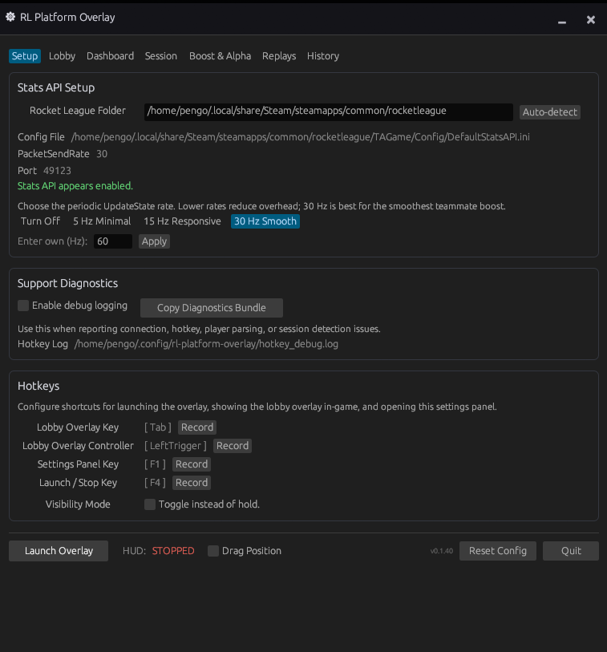
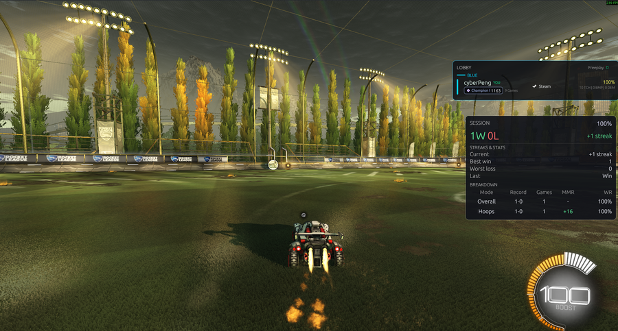
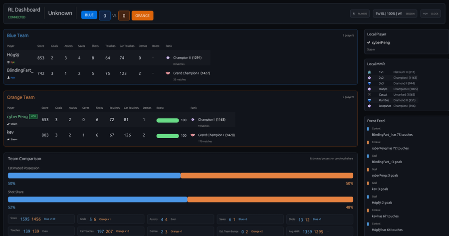

# RL-Platform-Overlay

RL-Platform-Overlay shows Rocket League lobby info, ranks/MMR, teammate boost, and session stats while you play.



It is a separate desktop app that reads Rocket League's Stats API output and displays match information on top of the game.

> [!IMPORTANT]
> **Anti-cheat safe**: The overlay runs outside Rocket League. It does not inject DLLs, modify game memory, or hook the renderer.

## Quick Start

1. Download the latest build from [Releases](https://github.com/Lucashamburguru/RL-Platform-Overlay/releases).
2. Open the app.
3. Go to **Setup**.
4. Click **Auto-detect** to find your Rocket League folder.
5. Click **Enable Stats API**.
6. Restart Rocket League if it was already running.
7. Set your hotkeys, Drag your overlays where you want them, click **Launch Overlay**, and play.

If auto-detect does not work, edit `TAGame/Config/DefaultStatsAPI.ini` in your Rocket League folder and set `PacketSendRate` to a value above `0`, such as `30.0`.

---

## What You Get

For matches:

* **Lobby overlay**: Shows player names, platforms, ranks, and MMR without needing to Alt-Tab.
* **Teammate boost HUD**: Optionally displays your teammate's boost with adjustable styles, size, and position.
* **Session tracker**: Tracks your current session record, win rate, streak, and play time.
* **Second-monitor dashboard**: Keeps lobby and session information visible on another screen.
* **Drag layouts**: Move and resize overlay panels, then keep them click-through while playing.
* **Hotkeys**: Toggle the overlay HUD or settings window from keyboard or controller buttons.

For replays and local tools:

* **Ball chasing replay integration**: Download/Upload saves to ballchasing.com
* **Hoops replay fixer**: Patches some broken legacy Hoops replay files and saves a backup first.
* **Gold Rush swapper**: Applies the Gold Rush / Alpha Boost look locally.

The app only changes local Rocket League files when you use the Gold Rush swapper or Hoops replay fixer.

---

## Screenshots

The overlay can run directly over Rocket League, or you can keep the dashboard open on another monitor.





---

## Developer Info

If you are a developer, want to compile from source, or want to contribute:

### Tech Stack

* **Language**: Rust
* **UI Framework**: egui / eframe (Glow renderer)
* **Input Hooking**: GilRs (Gamepad) & rdev (Keyboard)
* **Data Sources**: Rocket League Stats API and tracker.gg HTML scraping.

### Build from Source

Ensure you have the Rust toolchain installed.

#### Windows Build Dependencies

Building on Windows requires **CMake**, **NASM** (Netwide Assembler), and **LLVM** for `libclang`, which is used by `bindgen` while compiling BoringSSL/wreq dependencies.

You can install them with `winget`:

```powershell
winget install Kitware.CMake
winget install NASM.NASM
winget install LLVM.LLVM
```

Set `LIBCLANG_PATH` to your LLVM bin folder, for example `C:\Program Files\LLVM\bin`, then restart your terminal.

> [!NOTE]
> This project is mostly developed and tested on Linux. Windows builds may need extra packages, Visual Studio Build Tools, or local environment tweaks.

#### Build Command

```bash
cargo build --locked --release
```

### Running in Debug Mode

You can run the application with the `--debug` command-line flag to expose a dedicated **Debug** tab inside the settings interface (useful for inspecting raw packet data, process logs, and network state).

Windows compiled binary:

```powershell
.\rl-platform-overlay.exe --debug
```

Linux compiled binary:

```bash
./rl-platform-overlay --debug
```

From source:

```bash
cargo run --locked -- --debug
```

### Debug Capture

To save raw game output for parser debugging:

```bash
cargo run --locked --bin debug_game_output -- --seconds 30 --output rl_game_output_debug.txt
```

### Reporting Stats API Detection Issues

The app keeps a bounded, in-memory sample of up to the previous two minutes of Stats
API events while connected. If the detected game mode, teams, or match state is
wrong, open **Settings → Support** and click **Save Recent
Game API Log**. Attach the generated `rl_stats_issue_log_*.txt` file to the issue
report. Nothing is continuously written to disk.

These reports are identifiable: raw game events can contain player names,
account IDs, and match IDs. The app shows this warning before the save action.

---

## AI Disclosure

This project was developed and refactored with the assistance of **Gemini** and **Codex** AI coding models.

---

## License

MIT
