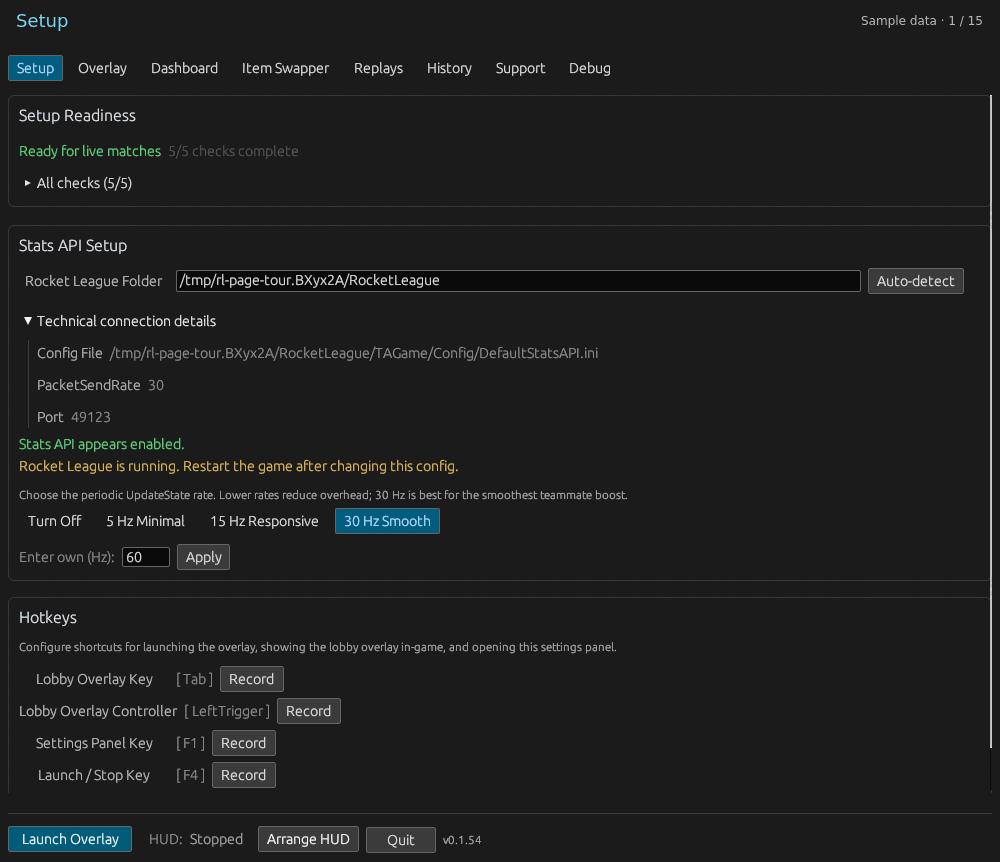
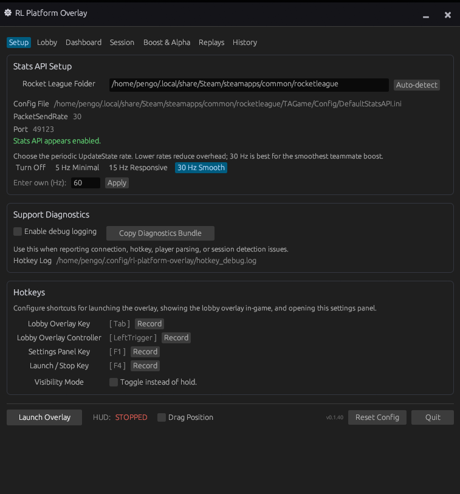
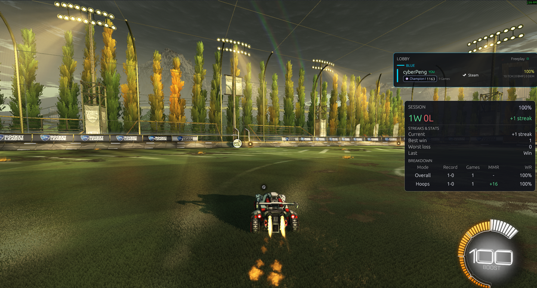
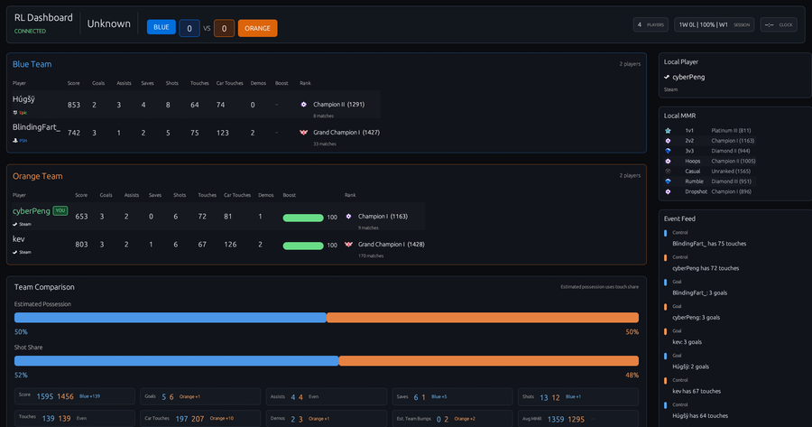

# RL Platform Overlay

RL Platform Overlay shows Rocket League player names, ranks, MMR, teammate boost,
and session statistics while you play. You can see this information without
leaving the game.

The app reads the built-in Rocket League Stats API and draws panels over the
game. You can also use a larger dashboard on a second monitor.

> [!IMPORTANT]
> **Separate app:** The app runs outside Rocket League. It does not inject DLLs,
> read or change game memory, or attach to the game renderer. This design does
> not guarantee compliance with future game rules or anti-cheat policies.

## Screenshots

The GIF shows the main pages, subpages, and record details. The pages use sample data.



<details>
<summary>Open the static screenshots</summary>

Use the compact overlay during a match. For a larger display, keep the dashboard
open on another monitor.







</details>

---

## Quick Start

1. Open the latest version on [Releases](https://github.com/Lucashamburguru/RL-Platform-Overlay/releases). For Windows, download **rl-platform-overlay.exe** from the **Assets** list. Double-click the downloaded `.exe` file to open the app.
2. Open **Setup**. Select **Auto-detect** to find your Rocket League folder.
3. Select **30 Hz Smooth** to enable the Stats API. If Rocket League is open, restart it.
4. Select your hotkeys. Use **Arrange HUD** to put the panels in position.
5. Select **Launch Overlay**. Then start a match.

If Auto-detect cannot find the game, select the Rocket League folder manually.
You can also change `TAGame/Config/DefaultStatsAPI.ini` manually.
Set `PacketSendRate` to a value greater than `0`, for example `30.0`.

---

## Features

### During a match

- **Lobby overlay:** See player names, platforms, ranks, and MMR without a change
  to the active window.
- **Teammate boost HUD:** See teammate boost. You can change the display style,
  size, and position.
- **Session tracker:** See your win and loss record, win rate, streak, and play
  time.
- **Second-monitor dashboard:** Use a larger display of lobby and session data
  on another monitor.
- **Panel positions:** Move the panels to the positions you want. During a
  match, mouse clicks pass through the panels to the game.
- **Hotkeys:** Show or hide the HUD and settings with a keyboard or controller.

### Replays

- **Ballchasing:** Upload, download, and organize replays through ballchasing.com.
- **Hoops replay repair:** Repair supported legacy Hoops replays. The app makes
  a backup before it changes the replay.

### Gold Rush preset

The app makes appearance and sound replacements from installed Alpha and Standard
Boost packages and sound banks. It downloads current package keys and keeps
verified backups. After a game update, the app makes the appearance package
again from the installed files.

### Item Swapper

You can search the installed item catalog and replace one item appearance with
another. The catalog includes bodies, wheels, boosts, trails, goal explosions,
toppers, antennas, and paint finishes. Replacements use current game files.
You can restore each item separately.

For boost sounds, you can:

- Keep the original sound of the target boost.
- Use the sound of the selected appearance.
- Select another installed boost sound.

To change only the sound, select the same boost for the appearance and target.

A shared sound bank affects all boosts that use that bank. Replacements can
share a bank if their sound selections agree. The app prevents replacements
with different sound selections for the same bank. Sound banks that the app
cannot change are unavailable in the selection list.

If you restore one appearance, other replacements keep the shared sound.
The original sound returns when you restore the last replacement that uses it.
To hear individual boost sounds, disable the Standard Boost audio override in
Rocket League.

### Engine Audio

The **Engine Audio** category in Item Swapper replaces one selectable engine sound
with another installed sound.

1. Select a source sound and a target engine sound that you own.
2. Apply the replacement.
3. In Rocket League, equip the target engine sound under **Engine Audio**.

Engine sound replacements use installed audio-profile packages. You can apply
or restore each replacement separately. Packages that the app cannot change are
unavailable in the selection list.

The Gold Rush preset, Item Swapper, and Hoops replay repair tool change local
game files or replay files when you use these tools.

---

## Help and Support

The [support and troubleshooting guide](docs/support.md) describes Setup Readiness,
connection problems, incorrect game mode or team detection, and diagnostic data
with privacy protection. It also explains recent Game API logs.

---

## Developer Information

This section describes the development tools and build commands.

### Development Tools

- **Language:** Rust
- **User interface:** egui / eframe with the Glow renderer
- **Input:** GilRs for gamepads and rdev for keyboards
- **Data sources:** Rocket League Stats API and an MMR provider that can be changed

### Project Documentation

- [Architecture](docs/architecture.md)
- [Rocket League Stats API notes](docs/API/stats-api.md)
- [Support and troubleshooting](docs/support.md)
- [Release process](docs/releasing.md)
- [Security advisory policy](docs/security-advisories.md)

### Build from Source

Install the Rust toolchain before you build the app.

#### Windows Build Dependencies

Windows builds require **CMake**, **NASM** (Netwide Assembler), and **LLVM**.
LLVM supplies `libclang`. The build uses `bindgen` and `libclang` for the
BoringSSL/wreq dependencies.

Install these tools with `winget`:

```powershell
winget install Kitware.CMake
winget install NASM.NASM
winget install LLVM.LLVM
```

Set `LIBCLANG_PATH` to the LLVM bin folder, for example
`C:\Program Files\LLVM\bin`. Then restart the terminal.

> [!NOTE]
> Development and tests occur mainly on Linux. Windows builds can require more
> packages, Visual Studio Build Tools, or changes to the local environment.

#### Build Command

```bash
cargo build --locked --release
```

### Debug Mode

Use the `--debug` command-line flag to show the **Debug** tab in settings.
This tab shows raw packet data, provider details, and network state.

For the compiled Windows app:

```powershell
.\rl-platform-overlay.exe --debug
```

For the compiled Linux app:

```bash
./rl-platform-overlay --debug
```

From source:

```bash
cargo run --locked -- --debug
```

### Debug Capture

Use this command to save raw game output for parser diagnostics:

```bash
cargo run --locked --bin debug_game_output -- --seconds 30 --output rl_game_output_debug.txt
```

### Update the Page Tour

Install ImageMagick 7. Then run this command from the project folder:

```bash
bash scripts/make-page-tour.sh
```

The script captures the actual user interface with sample data and makes
`assets/page-tour.gif`. It does not require a game installation or API credentials.

### Stats API Detection Problems

After a detection problem, the app can save recent Game API events.
Usually, you do not need to start a developer capture before the problem occurs.
See [Support and troubleshooting](docs/support.md#the-game-mode-teams-or-match-state-is-wrong).

---

## AI Disclosure

Development and code changes for this project used assistance from the
**Gemini** and **Codex** AI models.

---

## License

MIT
