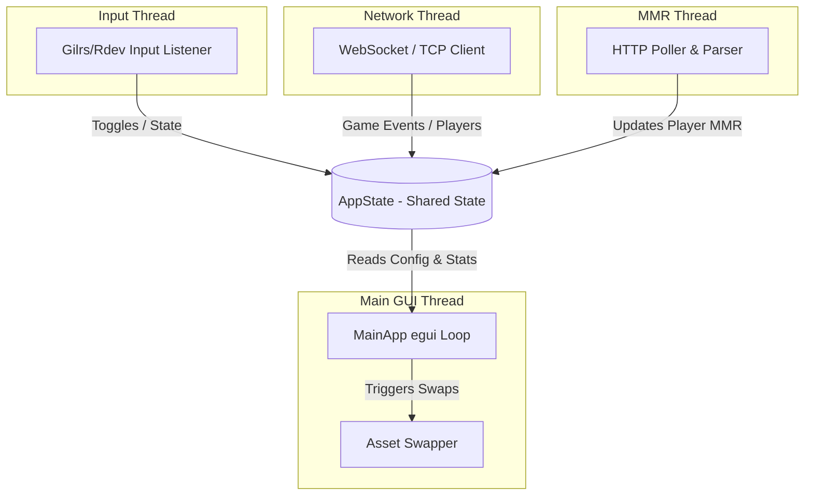

# System Architecture - RL Platform Overlay

This document describes the architectural layout, concurrency model, and platform-specific window integration techniques used in the Rocket League Platform Overlay.

---

## 1. Architectural Overview

The application is an **out-of-process transparent overlay** written in Rust. It runs as a separate OS process, reading real-time game state data broadcasted from Rocket League (via a BakkesMod plugin) and rendering a transparent HUD directly over the game screen using `eframe` and `egui`.

Because it runs completely out-of-process and does not perform code injection, it is fully invisible to anti-cheat systems.

---

## 2. Concurrency & Shared State

The application coordinates multiple concurrent systems using a thread-safe, centralized shared state wrapper called `AppState` (defined in [state.rs](file:///c:/Users/Pengo/Downloads/Dev/RL-Platform-Overlay/src/state.rs)).

### AppState Design
* Shared state is wrapped in an `Arc<AppState>` and passed to every thread.
* **Atomic Flags**: Thread-safe booleans and status values (like `is_launched`, `is_visible`, `local_team`) utilize atomic primitives (`AtomicBool`, `AtomicU8`) with `Ordering::SeqCst` for lock-free state reads and writes.
* **ArcSwap Config**: The application configuration uses the `arc-swap` crate, allowing lock-free, concurrent, read-heavy access to the configuration struct (`ArcSwap<Config>`). Writes are safely published by swapping pointers.
* **Locks**: Mutexes are sparingly used (e.g. `Mutex<String>` for Alpha Boost swap status) only where complex string updates occur synchronously.

### Threaded Components
1. **Main GUI Thread (`src/ui/app.rs`)**: Runs the `eframe` event loop, drawing the overlay when launched or the settings dashboard when stopped.
2. **Network Poller (`src/network.rs`)**: Runs asynchronously in a Tokio background task. It attempts a WebSocket connection to `ws://127.0.0.1:49123`. If it receives an HTTP version error, it automatically detects raw TCP traffic and falls back to a raw TCP client, parsing streams through a custom TCP JSON splitter.
3. **Input Listener (`src/input.rs`)**: Spawns dedicated background threads using `rdev` (for keyboard hooks) and `gilrs` (for gamepad input monitoring). It captures configured toggle buttons and flips atomic visibility flags.
4. **MMR Query Thread (`src/mmr.rs`)**: Manages stat fetching. When a new player identity is recognized in the lobby, it fetches HTML stats from tracker.gg, parses their rank, and caches it in `AppState::players` so that it persists during the match.

---

## 3. Windows-Specific Window Layout & Transparency

To draw a transparent, click-through window overlay on Windows that reliably covers the game without turning black or showing native OS title bars, we combine several deep Win32 API behaviors:

### A. Extended Window Styles (`WS_EX_LAYERED`) & DWM Glass Frame
* During startup, the window is created with `.with_transparent(true)` and `.with_decorations(false)`.
* When the overlay launches, we call `set_window_transparency`:
  * It toggles the window's extended style using `GWL_EXSTYLE` to add `WS_EX_LAYERED` (permitting pixel-level transparency).
  * It extends the desktop window manager (DWM) frame into the client area using `DwmExtendFrameIntoClientArea` with margins of `-1`. This renders any `[0, 0, 0, 0]` clear-color pixels in `egui` as completely transparent.

### B. Bypassing "Fullscreen Optimizations" (The Height - 1 Trick)
* **The Problem**: On Windows, if a borderless window matches the exact width and height of a monitor, Windows promotes it to the "Direct Flip" presentation queue. Direct Flip bypasses DWM composition for performance reasons, which breaks transparency and renders the entire overlay as a solid black screen.
* **The Solution**: We query the monitor dimensions using the Win32 functions `MonitorFromWindow` and `GetMonitorInfoW`, convert the coordinates to logical egui units, and size the window to `[width, height - 1.0]` (exactly 1 pixel shorter than the screen height). Because the window does not cover the exact physical monitor bounds, the OS keeps DWM composition active, maintaining transparency.

### C. Active Style Enforcement (OS Decoration Bypass)
* **The Problem**: Maximize/size changes inside `winit`'s event loop can trigger the OS to re-apply native caption buttons (minimize, maximize, close) in the top-right corner of borderless windows.
* **The Solution**: We implement `enforce_borderless_style`, which runs on every update loop on Windows. It queries `GWL_STYLE` using `GetWindowLongW` and strips:
  * `WS_CAPTION` (title bar and standard frame borders)
  * `WS_SYSMENU` (system menu, removing native top-right caption buttons)
  * `WS_THICKFRAME` (sizing/resize border)
  * `WS_MINIMIZEBOX` / `WS_MAXIMIZEBOX`
* If the style has changed, it applies the stripped style via `SetWindowLongW` and calls `SetWindowPos` with the `SWP_FRAMECHANGED` flag to force Windows to re-evaluate the frame immediately.

### D. Custom Window Dragging
* Because native decorations are disabled, a custom title bar is rendered in egui when in "Stopped" mode.
* A click-and-drag listener monitors this custom title bar. When a drag is initiated (`is_pointer_button_down_on`), it immediately sends `egui::ViewportCommand::StartDrag` to the OS event loop. This passes the dragging task back to the OS window manager, ensuring immediate and smooth window dragging without lag.
