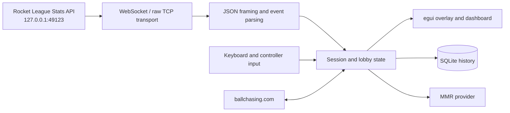

# RL Platform Overlay architecture

This document describes the current runtime architecture, data flow, concurrency model, persistence, and platform-specific window behavior.

## System overview

RL Platform Overlay is an out-of-process Rust desktop application. It does not inject code, read Rocket League process memory, or hook the game's renderer. Instead, it configures Rocket League's built-in local Stats API and connects to its loopback endpoint at `127.0.0.1:49123`. The app renders its own transparent, click-through HUD with `eframe`/`egui` and can open a separate second-monitor dashboard.

The local Stats API is the sole source of live game telemetry. BakkesMod is not required.



This out-of-process design avoids invasive integration with Rocket League and
uses a game-provided local API. It is not a guarantee about future game or
anti-cheat policy.

## Startup and runtime lifecycle

[`src/main.rs`](../src/main.rs) creates the Tokio runtime and calls `run` in [`src/lib.rs`](../src/lib.rs). Startup proceeds in this order:

1. Initialize application logging and create the shared [`AppState`](../src/state.rs).
2. Load `config.toml`, migrate legacy replay-upload membership into `replays.sqlite3`, start the asynchronous config writer, and initialize or recover `history.sqlite3`.
3. Inspect the Rocket League installation and, when configured, enable or repair `DefaultStatsAPI.ini` through [`src/setup.rs`](../src/setup.rs).
4. Load history totals and refresh the cached local player's rank when an identity is available.
5. Start the Stats API network task, default MMR-provider worker, keyboard/controller listeners, release check, and initial replay scan.
6. Enter the `eframe` event loop and render either the settings window, in-game overlay, second-monitor dashboard, or a combination of them.

Most long-running I/O uses Tokio tasks. Global keyboard and controller listeners and the config writer use dedicated OS threads because their libraries or blocking behavior are better isolated there.

## Live telemetry pipeline

### Stats API configuration

[`src/setup.rs`](../src/setup.rs) reads and updates:

```text
TAGame/Config/DefaultStatsAPI.ini
```

The relevant section is `TAGame.MatchStatsExporter_TA`. The app preserves an existing positive packet rate, can write a selected rate, defaults the port to `49123`, and creates a backup before changing an existing file. Rocket League must be restarted after a configuration change.

### Transport and framing

[`src/network.rs`](../src/network.rs) continuously reconnects to the loopback endpoint:

- It first attempts `ws://127.0.0.1:49123` with `tokio-tungstenite`.
- If the handshake indicates raw TCP instead of WebSocket, it reconnects with `tokio::net::TcpStream`.
- Raw TCP bytes pass through `TcpJsonSplitter` in [`src/stats_api.rs`](../src/stats_api.rs), which separates complete JSON values while handling strings, escapes, and fragmented reads.
- Connection state, transport type, errors, and the most recent event name are published as diagnostics.
- A bounded in-memory diagnostic buffer retains up to approximately two minutes of recent Stats API payloads. It is written to disk only after an explicit support action and warning because payloads can contain player and match identifiers.

The end-user collection and privacy workflow is documented in
[Support and troubleshooting](support.md).

### Parsing and state transitions

[`src/stats_api_parser.rs`](../src/stats_api_parser.rs) converts loosely shaped JSON into typed parsing results and signatures. It is responsible for:

- normalizing event envelopes and nested `Data` values;
- parsing players, platforms, teams, local-player hints, scores, and match GUIDs;
- inferring session mode with an associated evidence source;
- producing roster, score, mode, and result signatures used for deduplication and diagnostics.

[`src/network.rs`](../src/network.rs) routes parsed events and publishes resulting state. [`src/session.rs`](../src/session.rs) owns session-oriented rules such as match start/reset, clock and score updates, mode records, streaks, early leaves, results, and replay exclusion.

Completed matches can update SQLite history, trigger post-match automation, and schedule replay upload work. Event processing also maintains touch debouncing, replay touch offsets, teammate-bump estimates, a stable match roster, and a coherent `DashboardMatchSnapshot` for completed-match display.

## Shared state and concurrency

The process shares a single `Arc<AppState>` across the UI, Tokio tasks, and input/config threads. `AppState` groups state by domain:

| Domain | Main responsibilities |
| --- | --- |
| `flags` | Overlay launch, HUD/settings visibility, connection, replay, and exit flags |
| `hotkeys` | Recording state and keyboard/controller edge tracking |
| `game` | Players, local identity/team, session, match roster, touch state, and dashboard match snapshot |
| `system` | Configuration, setup/update status, HTTP clients, and automation coordination |
| `diagnostics` | Frame/resource/foreground tracking, captures, and recent Stats API events |
| `mmr` | Provider selection, MMR cache, local refresh coordination, and debug status |
| `history` | SQLite connection, encounter summaries, totals, and refresh state |
| `replays` | Ballchasing status, SQLite upload ledger, SHA-256 upload coordination, sync/download work, and metadata caches |
| `boost` / `hoops_fixer` | Local tool status and background-work guards |

The synchronization strategy matches the data shape:

- Atomic booleans and integers represent small flags and counters.
- `ArcSwap<T>` publishes immutable, read-heavy snapshots such as configuration, players, session state, MMR results, and progress models.
- Mutexes protect compound mutable coordinators, queues, SQLite ownership, bounded logs, and status text.
- Configuration changes are serialized by `config_update_mutex`, published through `ArcSwap`, assigned a revision, and sent to a dedicated writer thread. The writer coalesces pending revisions and atomically replaces the TOML file using a flushed temporary file.

The UI must not perform network or long-running filesystem work in the render loop. UI actions publish configuration or start background work, and completion is returned through state snapshots/status values.

## UI and window model

[`src/ui/app.rs`](../src/ui/app.rs) owns the primary `eframe` window. It has two main modes:

- **Stopped/settings mode:** a decorated-in-egui application surface with a custom title bar.
- **Launched overlay mode:** a transparent, always-on-top surface that draws the lobby, session, and teammate-boost HUDs. It becomes mouse-passthrough when settings and layout mode are closed.

The second-monitor dashboard is a separate deferred egui viewport implemented in [`src/ui/dashboard.rs`](../src/ui/dashboard.rs). [`src/ui/monitor.rs`](../src/ui/monitor.rs) selects a monitor and computes fullscreen or centered windowed placement. Dashboard visibility is independent of whether the in-game overlay remains enabled.

The UI module is split by responsibility:

```text
src/ui/app.rs                 application/viewport lifecycle
src/ui/lobby_overlay.rs       lobby and player HUD
src/ui/session_hud.rs         session overlay
src/ui/boost_hud.rs           teammate boost HUD
src/ui/dashboard.rs           second-monitor dashboard
src/ui/settings/              settings and support tabs
src/ui/monitor.rs             monitor enumeration and placement
src/ui/layout.rs              interactive HUD arrangement
src/ui/debug.rs               debug-only inspection UI
```

## Windows transparency and borderless behavior

Windows needs additional handling beyond `ViewportBuilder::with_transparent(true)`:

1. **Layered DWM surface:** while launched, `set_window_transparency` applies `WS_EX_LAYERED`, sets full alpha, and extends the DWM frame through the client area. Clear egui pixels then remain transparent. The style and margins are removed again in stopped mode.
2. **One-pixel-short overlay:** the primary overlay is placed at the nearest monitor origin and sized to the monitor width and one logical pixel less than its height. Avoiding an exact monitor-sized borderless surface keeps Windows composition behavior compatible with transparency on affected systems.
3. **Mouse passthrough:** egui's `ViewportCommand::MousePassthrough` is enabled only when the overlay is launched and neither settings nor layout mode needs pointer input.
4. **Borderless style enforcement:** every frame, `enforce_borderless_style` removes caption, system-menu, thick-frame, minimize, and maximize styles that Windows/winit can reapply during viewport changes.
5. **Custom dragging:** in stopped mode, dragging the custom title-bar region sends `ViewportCommand::StartDrag`; close and minimize controls remain excluded from that drag region.

On non-Windows systems, the launched primary viewport uses the platform's fullscreen behavior rather than the Win32 layered-window path.

## Persistence and external services

### Local persistence

- `config.toml` stores user settings, cached local identity, replay settings, and integration credentials. On Unix it is created and repaired with owner-only permissions.
- `history.sqlite3` stores optional match/player encounter history and uses versioned migrations plus corruption recovery.
- `replays.sqlite3` stores normalized replay upload membership, content hashes, remote IDs, file fingerprints, and timestamps. Automatic and bulk uploads share a content-keyed coordinator and publish a revisioned in-memory ledger snapshot for the UI.
- Replay files and backups remain in user-selected Rocket League/replay directories.
- Diagnostic logs or support exports are created only by the relevant enabled or explicit user action; recent raw Stats API events are otherwise memory-only.

The application data directory is `%APPDATA%/RL-Platform-Overlay` on Windows and `$XDG_CONFIG_HOME/rl-platform-overlay` or `~/.config/rl-platform-overlay` on other supported systems.

### External network boundaries

| Destination | Purpose | Trigger |
| --- | --- | --- |
| Rocket League loopback endpoint | Live match telemetry | Continuous reconnect while the app runs |
| mmr.kmdw.dev (mmr-api-v2) | Rank/MMR lookup | Lobby players or explicit local refresh |
| ballchasing.com | Replay upload, listing/sync, metadata, and download | User enables/configures the integration or starts an action |
| GitHub Releases | Version metadata and release assets | Startup version check or user-approved update |

The shared HTTP clients have 15-second timeouts. The Ballchasing client disables redirects; pagination URLs are separately constrained to the expected HTTPS host. No code in the current architecture sends required first-party usage telemetry.

## Updates and distribution variants

Non-Microsoft-Store builds use [`src/update.rs`](../src/update.rs) to inspect GitHub Releases. A Windows update is accepted only after both its SHA-256 checksum and Ed25519 signature verify against the embedded release public key. The replacement is staged under the app config directory and launched through a generated update script.

The `microsoft-store` Cargo feature removes self-update, post-match input automation, and the Gold Rush file-swap controls that are inappropriate for the Store package. CI validates normal Linux/Windows builds and the Microsoft Store/MSIX feature combination.

## Architectural boundaries to preserve

- Keep all game access out-of-process and limited to documented local files and the loopback Stats API.
- Keep Stats API parsing deterministic and independently testable from transport I/O.
- Never block the egui render loop on HTTP, replay scans, database work, or file modification.
- Publish compound read-heavy state as immutable snapshots instead of exposing partially mutated values.
- Keep external integrations optional, bounded, and explicit about the data they transmit.
- Preserve update signature verification in addition to checksum validation.
- Treat exported raw Stats API events, player/account identifiers, replay tokens, configuration, and local paths as sensitive data.
